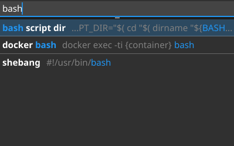

# snippet

[](https://github.com/sandro-h/snippet/actions/workflows/ci.yml)

Tiny cross-platform widget to insert snippets into the terminal, editor, etc.



## Usage

1. `Alt + q` to show widget
2. Start typing in search box to find snippet (fuzzy search)
3. Use `up` and `down` arrows to navigate search results
4. Press `enter` to choose snippet. Widget disappears and snippet is typed in active window.
5. Press `escape` to cancel search and hide widget again.
6. Press `Alt + F4` while widget is active to close it for good.

Snippets are stored in `snippet.yml` file, see [snippet_sample.yml](snippet_sample.yml).

Optional configuration is stored in `config.yml` file, see [config_sample.yml](config_sample.yml).

## Development

```shell
make build-linux
make build-windows
make test
make lint
```

See `Makefile`'s `install-sys-packages` for required system packages for compilation.
